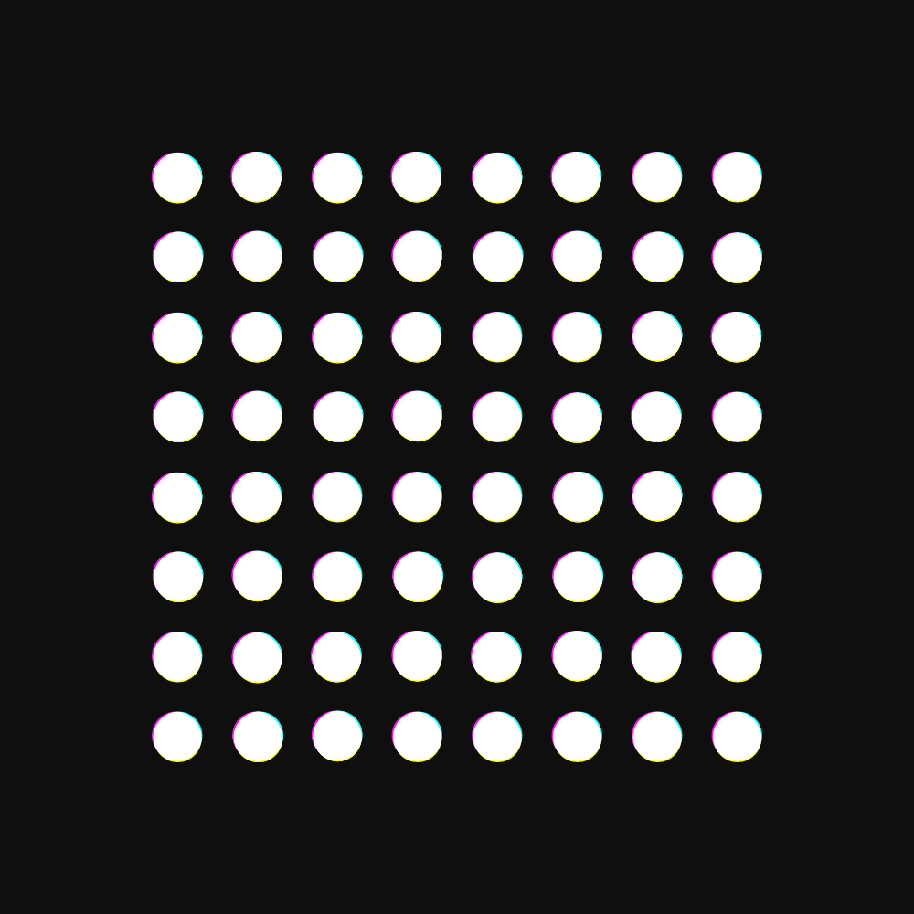
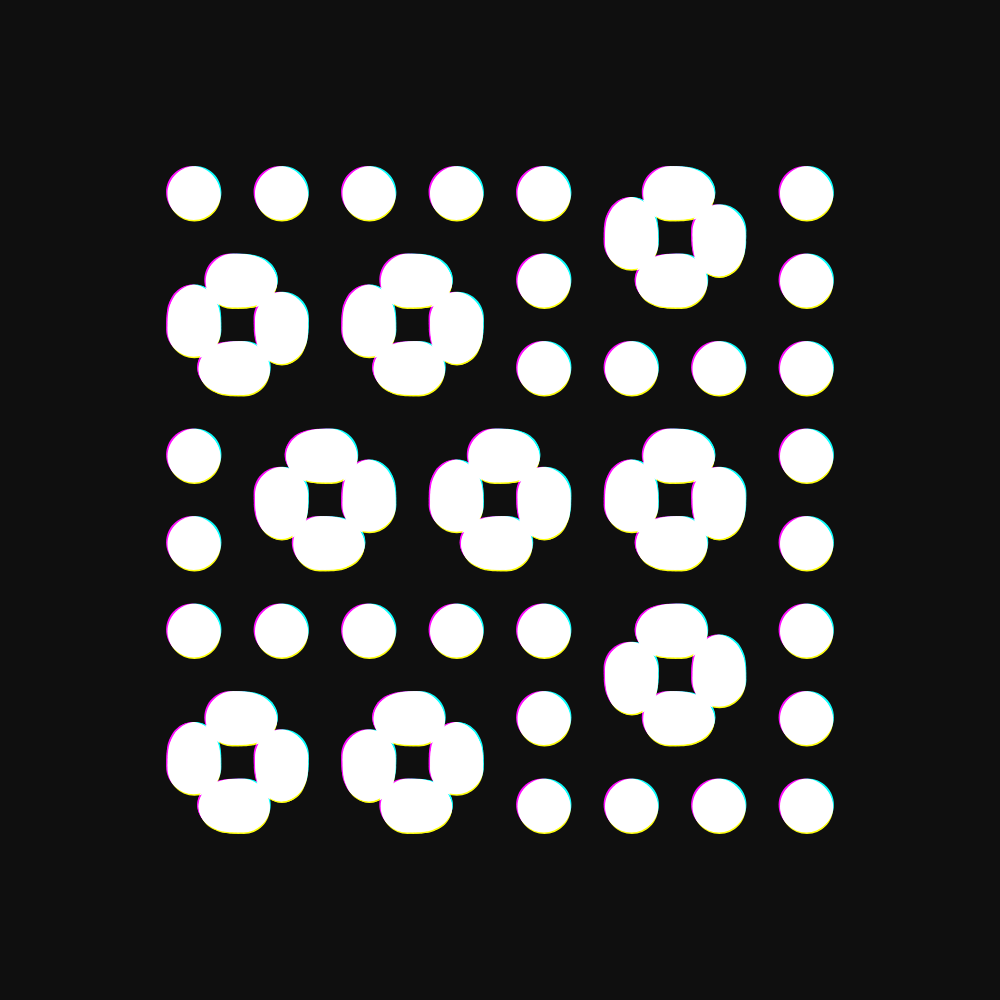
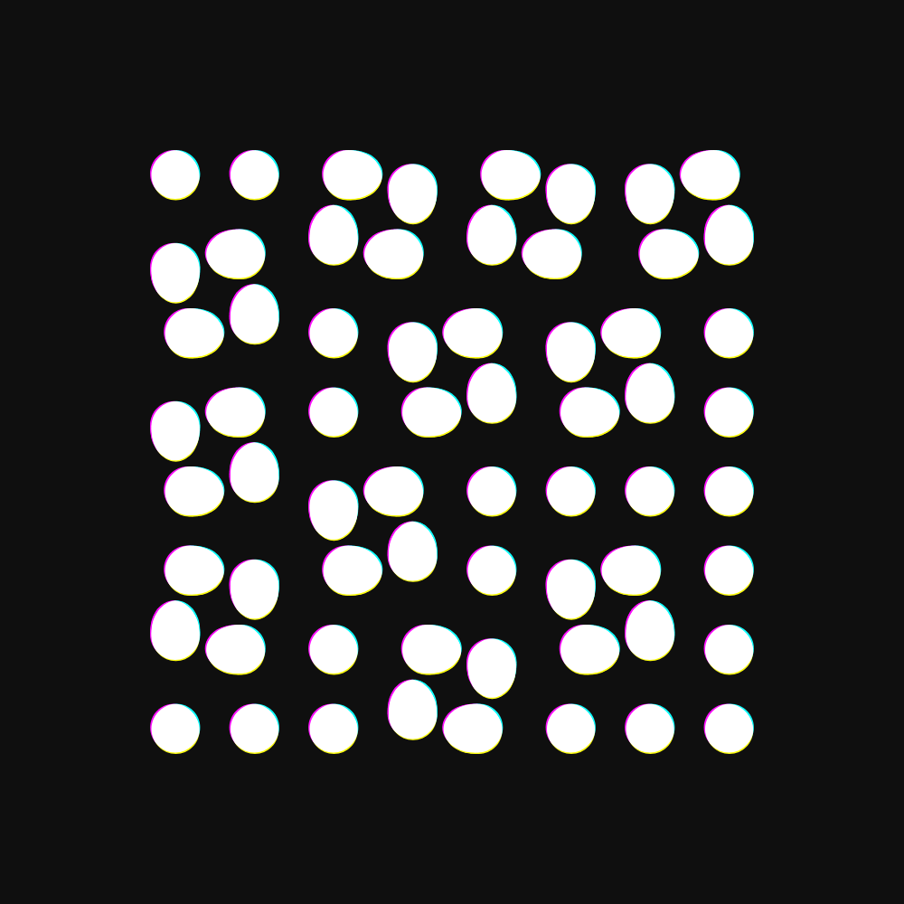

# Circle

`Circles! They move!`

Try it [here](https://lorossi.github.io/CIRCLES-SWAP/).

If you want to see this *(and many other things!)* in action, be sure to check my [Instagram profile](https://instagram.com/lorossi97).

## What

As many times before, there is not much else to say.
I made this simple animation a while back and I thought it would be nice to share it, after forgetting about it for about a year or so.

It features a simple looping animation where circles exchange themselves in square formations, with some colour aberration sprinkled on top.

*Of course it perfectly loops over and over again.*

## Output

## Credits

This project is distributed under Attribution 4.0 International (CC BY 4.0) license.
